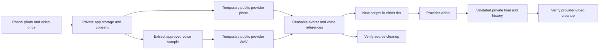

# HeyGen temporary-upload bridge

Date: September 30, 2026. Status: prepared; independent advisory architecture and risk reviews approve the design/local implementation handoff only. Owner selected this direction; real uploads, deletion, provider spending and deployment are not authorized by this design.

## Decision and customer experience

Video OS is the customer workspace and orchestration layer. HeyGen supplies the avatar, reusable voice and generated video. A customer enrolls once with a photo and phone video, then writes scripts for either tier. The photo determines appearance; only its approved bytes and the consented extracted WAV go to HeyGen.

Keep three lifecycles separate:

| Resource | Keep until | Cleanup condition |
|---|---|---|
| Private application photo/video/WAV | The application's disclosed retention policy or customer withdrawal | Existing owned-source expiry/revocation rules; no automatic reinterpretation of provider cleanup as local deletion |
| Temporary public HeyGen photo/WAV asset | The derived avatar/voice is actually ready and durable receipts exist | Qualified dependency gate, DELETE acknowledgment, exact API absence and a separate old-URL access-denial observation |
| Reusable HeyGen avatar/look/voice | Customer keeps the authorized identity | Revocation, no live references/in-flight work, exact ownership and cascade checks, then verified resource removal |
| Generated HeyGen video | A durable private final is fully validated and accepted | Matching private stored/downloaded bytes, provider DELETE, exact API absence, separate old delivery-URL denial |
| Private accepted final | Customer retention/deletion policy | Existing private-final deletion path; never use that field to represent provider-video deletion |

## Facts, policy choices and unknowns

**Documented facts:** [asset upload](https://developers.heygen.com/docs/upload-assets) returns a public URL; no private/expiry switch is documented for the multipart API in this repository. [Asset deletion](https://developers.heygen.com/reference/delete-asset), [look deletion](https://developers.heygen.com/reference/delete-avatar-look) and [voice deletion](https://developers.heygen.com/reference/delete-a-voice) exist. Deleting the last look also deletes its parent group. Voice deletion can be blocked by template use. Instant voice clone creation has no documented idempotency-key guarantee.

**Additional provider-policy gate:** confirm the actual API account's model-improvement/training opt-out and its scope before customer uploads. Necessary creation of the customer's requested avatar/voice is distinct from broader provider model training. Asset deletion cannot be described as reversing past training. Provider confirmation or a qualified account agreement is required; do not invent an opt-out API or send a support/privacy email without the owner's instruction.

**Not proven:** deleting a raw photo/audio asset preserves the ready avatar/voice; DELETE success plus GET404 revokes the old public CDN URL; the connected account is the application's production account. "Temporary" describes the raw upload copies, not the reusable identity itself. The canary must also inventory/probe any returned avatar/look/voice preview URLs; account-private ownership does not prove URL-private access. Do not claim all public exposure ends with raw-asset deletion. If retained identity previews remain accessible, disclose that separately and return the exposure policy to the owner before customer activation. Those are explicit canary gates. Provider privacy-policy deletion/backup timelines must not be presented as a per-asset API purge SLA; their applicability needs confirmation. [HeyGen privacy policy](https://www.heygen.com/privacy).

**Proposed application policy, not a provider promise:** request cleanup within five minutes of the safe readiness/acceptance event; warn at five minutes; contain new affected work and escalate at fifteen minutes of unresolved cleanup. An enrollment still unfinished at 24 hours is expired/contained and removal is attempted where the provider supports it. A failure or unknown remote operation remains visible; the system cannot guarantee a hard provider purge deadline it does not control. These timers are proposed defaults to validate with the canary, not current implementation or activation approval.

## Consent and honest status

Introduce consent policy `identity-provider-bridge-v2` with a distinct, initially unchecked `temporaryPublicProviderExposureAuthorization` permission. Preserve the existing extraction, likeness, reusable voice, provider processing and withdrawal scopes. Enrollment consent is authoritative for source extraction/exposure; linked identity consent must corroborate its exact policy/source hashes and cannot broaden it. Existing records do not silently gain the new permission. Re-consent uses the exact existing source hashes and owned identity; it does not require another recording when the private sources remain valid.

Explain before upload that the provider receives temporary files at public links, that reusable provider identity resources remain for future scripts, and that API/access removal does not certify backup erasure. A refusal means no provider upload. For resources already uploaded under an older policy, freeze new uploads, inventory the existing exposure and offer withdrawal/re-consent. New consent authorizes future handling only; it does not retroactively cure prior undisclosed exposure. Never display a raw provider URL. Customer states distinguish "Preparing presenter", "Removing temporary provider files", "Ready", "Removal requested" and "Needs attention". Do not say "deleted everywhere".

## State and evidence contract

For each exact resource:

`LOCAL_PRIVATE_VALIDATED -> PROVIDER_PUBLIC_UPLOADED -> DERIVATION_ACCEPTED -> DERIVED_READY -> DELETE_CLAIMED -> DELETE_ACKNOWLEDGED -> API_ABSENT -> URL_DENIAL_OBSERVED`

Readiness and cleanup are distinct facts. API absence, public access denial and provider backup retention remain separate fields. A timeout, malformed response, authorization error, still-readable URL or unknown creation result becomes `PENDING_RECONCILIATION`; it never means success or permission to recreate.

Minimum private receipt: schema/policy version, local account/enrollment/identity/job IDs, provider-account fingerprint, exact resource kind and ID, origin operation key, local source hash/bytes, a digest of the returned URL and an access-controlled evidence-object reference, exposure start, derived IDs/readiness proof, approved plan digest, deletion claim/result, exact GET result, anonymous URL probe result, timestamps and bounded attempts. Raw provider URLs live separately in encrypted private evidence storage with an explicit retention deadline. The database/audit ledger keeps only their digest and private-object reference. Delete URL material after the approved observation/support window; retain non-sensitive proof digests. Never expose URLs through DTOs, Git, routine logs or screenshots.

Use the exact current receipt paths as candidate sources: `avatar:asset.providerAssetId`, `voice:asset.providerAssetId`, `avatar:create.providerRenderableAvatarId`, `avatar:create.providerAvatarGroupId`, `voice:create.providerVoiceId`, and `video_jobs.provider_job_id`. Corroborating identity/media columns do not grant deletion authority. Names and list order never establish ownership. Unknown receipt fields or ambiguous operations with no returned ID block completion.

Existing JSON receipts are acceptable input for read-only inventory, but not the execution ledger. Before enabling DELETE, add a small normalized provider-resource ledger with unique account/kind/provider-ID ownership, immutable origin/creation attempts, durable consumer references/tombstones and append-only deletion/probe events. Use at least resources, operations and events tables; add a consumer-reference table if transactional reference enforcement cannot be implemented safely through the existing tables. Schema design/lock-order review is a required implementation gate, not permission to add an unreviewed migration. Preserve unknown/no-ID operations as first-class rows. Backfill only exact corroborated receipts; unresolved historical IDs remain held. Provider-video events must not reuse `videoDeletedAt`, which describes the private final.

## Qualification record

A deletion-dependency qualification is a versioned private resource, keyed by provider-account fingerprint, API version, explicit supported avatar engine/model, resource kind, fixture hashes, candidate adapter digest, observed source deletion, derived-resource survival and URL observations. Record observedAt, validUntil and owner-approved cohort. Proposed pilot validity: at most seven days or the approval-envelope expiry, whichever is earlier. Provider/API/engine/request-semantic changes invalidate the qualification; credential rotation requires a fresh account/scope binding, never an assumed match. Record and approve any longer-lived qualification policy separately. No editable boolean or old connector observation clears this gate.

Until both photo and WAV qualification records pass, new customer enrollment remains contained. The owner has selected a design, not approved retaining public assets indefinitely if deletion breaks the derivative.

## Safe cleanup rules

1. **Raw asset cleanup:** require all dependent provider resources READY, durable IDs/receipts, current routine-cleanup authority and the account/API/engine-specific dependency qualification. Withdrawal cleanup instead uses historical exact-source provenance plus current withdrawal authority; it never requires consent to remain active. Check every consumer, including other identities and provider templates. MVP uploads are unique to an enrollment/operation; do not share provider upload IDs across identities. Same-identity reuse across scripts is expected for avatar/voice resources, not an excuse to reuse deleted raw assets. Clear operational provider-asset caches after confirmed removal; retain audit IDs. A future authorized re-enrollment must re-upload from verified private bytes rather than reuse a deleted provider asset ID.
2. **Generated video cleanup:** require ready job, accepted output proof, exact owned private object hash/bytes and a matching authorized download. Keep private history working independently of HeyGen afterward. A provider-ready flag or successful network download alone is insufficient.
3. **Revocation:** stop new identity and render claims immediately, including legacy identity-bound HeyGen submissions. Hold deletion around in-flight/ambiguous jobs until cancellation/settlement is known. Retain the reusable avatar/voice until withdrawal; raw asset cleanup never means deleting the reusable identity.
4. **Cascade protection:** prefer deleting the exact owned look. Re-read its parent afterward because last-look deletion can remove it. Explicit group deletion requires a complete provider membership inventory proving every affected look belongs to this approved scope. Locally known looks alone are insufficient; block if membership is unknown or shared.
5. **Reference races:** all provider-reference mutations first acquire a transaction-scoped advisory lock in the `provider-lifecycle-v1` namespace for the owning application account, before any row lock. This common guard serializes short metadata transactions for one account; HTTP remains outside the transaction. Then use this frozen order, skipping unneeded classes: existing request/idempotency advisory lock; approval nonce row; existing job rows sorted by ID; credit account; projects; enrollments; identities; consent rows; media assets; normalized provider resources; consumer references; operation rows. Rows within a class are sorted by stable ID. New job/event inserts use unique server IDs after prerequisite locks. Recompute plan and expiry after all blocking locks. Bring current reserve/claim/revoke paths behind this guard and compatible order before DELETE is enabled; contain/drain old mutators during cutover. Unconverted legacy paths are disabled for new work. Existing job-then-credit and request-key reservation semantics remain inside the guard, rather than permitting a deletion-specific reverse order. Commit a deletion claim/tombstone before external calls. Enrollment component creation, source attachment, scripted reservations/submissions, legacy identity-bound HeyGen submission, template use and look/group membership must all respect it. Ambiguous jobs remain consumers. Unknown out-of-band use blocks automatic deletion; qualify an app-controlled resource namespace/workspace and do not assume the provider exposes a complete asset-reference inventory. No new consumer may attach while cleanup is claimed. Do not hold a database transaction open across HTTP.
6. **Ambiguity:** remote success followed by persistence failure leaves a durable claim. Resume first reads the exact resource under the same verified provider account. A repeat DELETE is permitted only for the same approved resource/digest and a qualified resource-specific contract. 404 from a wrong account, bad route, proxy or unowned ID never counts as proof.
7. **Withdrawal remains available:** cleanup authorization is separate from create/render flags. Disabling enrollment must not prevent deletion or read-only reconciliation. Raw-source cleanup can finish while reusable identity resources remain authorized; do not overload a single global status to mean both operations.

## Approval trust root

The deletion CLI cannot authorize itself. An owner-controlled approval issuer, separate from the deletion worker, creates and signs an approval envelope with an Ed25519 key unavailable to that worker. The worker verifies a pinned public key from reviewed deployment configuration; no CLI key override, environment boolean or supplied digest replaces the signature. Key provisioning/rotation is an explicit owner action before execution, not something this plan performs.

The signed body binds the exact plan digest and candidate, application target/account, provider-account fingerprint, exact resource kinds/IDs, allowed verbs/actions, call and spend ceilings, expiry, nonce and canary/cohort. Store approval in an immutable private registry; atomically consume its nonce with the matching deletion claim, and support issuer revocation. A consumed approval can resume only its existing operation and remaining signed call budget; it cannot start a second plan or replenish retries. Missing, forged, expired, wrong-target, revoked or replayed approvals fail before provider access.

For the first disposable/operator batch, the owner approves exact resources or an exact creation envelope whose cleanup is limited to IDs returned by its specified disposable operations. Customer-wide automatic cleanup is not enabled by that canary. A later owner-signed bounded policy/cohort may delegate routine cleanup or authenticated customer withdrawal to the issuer; the issuer independently rehydrates receipt/consent/reference evidence and issues exact per-resource child approvals. The worker cannot mint those approvals. Until the issuer and its limits are verified, cleanup remains operator-scoped and customer enrollment contained. This preserves customer withdrawal without treating an informal CLI flag as authority.

This boundary assumes trusted deployed code and issuer custody; it does not claim that a fully privileged administrator or stolen provider API key is constrained by a local CLI.

## Operator surface and implementation slices

No broad cleanup-all operation. Proposed CLI verbs: `plan`, `status`, `execute`, `resume`.

- `plan` is database-read-only and emits an exclusive-create private plan with exact candidate references, exclusions, account/target binding, source snapshot, expiry and SHA-256 digest. A separate read-only inspection performs provider GETs only after credential/account binding.
- `execute` requires an unexpired exact plan, issuer-signed approval plus its bound digest and exact resource scope, verified target/account, and a separate deletion enablement gate. It rechecks references under locks, records a claim, calls the provider outside the transaction, and persists results even if revocation wins. No `--force`, arbitrary URL, name or inventory-delete mode.
- `status` is read-only. `resume` never generates another avatar/voice or changes the target resource; unknown creations with no strong ID evidence remain held for operator/provider reconciliation.

Suggested files and order:

1. `lib/heygen-reconciliation-contract.js`: versioned resources, plan digest, state rules, dependency/cascade/reference constraints and redacted output.
2. `services/heygen.js`: fixed-path read/delete adapters with bounded timeouts, exact response-code handling and no raw-body logging. Keep instant voice and model voice namespaces distinct. Use stable upload idempotency where documented; do not invent it for instant cloning.
3. Reviewed additive migration plus `db/provider-reconciliation-repository.js`: normalized resource/operation/event ledger, repeatable-read snapshot, transactional claims/tombstones, append-only results and cross-resource guards. Implement the frozen account guard and ordered row-lock protocol above for every attach/delete/revoke path and prove it with real concurrency tests before enabling cleanup. Cross-account resource ownership is invalid and blocks a plan; MVP deletion batches span one application account only. This future migration is not part of the already-applied 0007/0008 baseline.
4. `tools/reconcile-heygen-enrollment.mjs`: private plan/status/execute/resume boundary with exact approval scope. Integrate durable retries/alerts only after the operator path is tested.
5. `lib/enrollment-policy.js`, enrollment/identity routes and UI: new consent version, explicit exposure permission, re-consent without re-recording, cleanup-aware availability and truthful status. Design/review this UI slice before implementation.
6. `workflows/video-render.js`, output acceptance and job events: provider-output cleanup after durable private acceptance, without changing ledger/final deletion meanings.

This is an implementation handoff, not a claim these deletion modules exist. Existing receipt, local cleanup, quote and private-final controls are already implemented. The separately authorized local release-boundary repair is being tested in this session.

## Disposable canary proposal

Prepare an exact non-production test envelope before execution: target app/provider account, API scopes, source/build digest, private receipt destination, fixture hashes, allowed API operations, maximum calls, explicit credit/spend ceiling, no unapproved retry, and cleanup of only IDs returned by that canary. Existing customer resources are excluded.

Phase A: use non-personal disposable image/audio assets to observe upload, authenticated read, anonymous baseline bytes, DELETE, exact API absence and repeated old-URL denial. Prove account binding and actual credit effect; do not assume an upload is free merely because it is not rendering.

Phase B: with separately consented test media and approved spend, create one reusable photo avatar and one instant voice. Wait for READY, delete only the source assets, then prove the avatar/voice remain usable by a bounded new-script render in each enabled tier. Validate/store/download the private outputs, then delete provider videos and test their old URLs. Finally revoke and reconcile the disposable reusable resources, including the last-look cascade and any template/pending blockers. No real-person clone without subject consent.

For URL proof, first observe the exact returned URL anonymously serving the expected source hash. After removal, use fresh unauthenticated bounded GETs at separated times; record 403/404 as observed access denial. Network errors, redirects to unknown hosts, auth failures at the API, 5xx, empty unexpected bodies, or a changed URL do not pass. Use approved HTTPS hosts, DNS/redirect checks and strict byte caps. This proves observed denial at those times/locations, not global cache or backup erasure.

Stop on a wrong account, unexpected resource, altered reference, repeat creation, unexpected spend, dependency regression or still-public URL. Preserve receipts and contain new affected work. Do not silently retain public assets or switch providers if the dependency canary fails; return the design choice to the owner.

## Deliberate review summary

Principles: exact source/consent binding; minimal exposure; no false deletion claims; reusable identities without repeat recording; no duplicate remote work or charges.

Top drivers: owner-selected HeyGen bridge, record-once UX, verifiable withdrawal and retained private history.

Options:
- **A. Event-bound temporary-public bridge (selected, conditional):** fits the chosen API and MVP; adds deletion/reconciliation machinery and requires dependency/CDN proof.
- **B. Retain raw provider assets for the identity lifetime:** simpler and avoids dependency uncertainty; incompatible with the requested temporary-upload objective unless the owner explicitly changes it. Rejected for this design.
- **C. Qualify a provider-private/contracted storage arrangement:** could reduce link exposure, but current multipart docs provide no such switch and account availability/cost are unknown. Keep as fallback if A fails; do not invent support or change provider silently.

Pre-mortem:
1. Source deletion breaks the reusable voice/avatar: do not enable automated cleanup before a real dependency canary; retain private source bytes for authorized recovery, never blindly clone again.
2. API says absent while CDN still serves bytes: keep exposure open/PENDING, stop new affected uploads, alert and escalate; never report full deletion from API success alone.
3. Revocation races with accepted remote work or new references: durable claims, reference locks/tombstones, append-only returned IDs, exact-scope resumes and late-result reconciliation prevent untracked resources.

## Acceptance and verification

The [acceptance test specification](HEYGEN-BRIDGE-TEST-SPEC.md) covers unit, real isolated DB/Blob integration, browser and observability cases. Local tests must prove exact-ID ownership, digest drift rejection, cross-account/reference denial, single-winner claims, receipts surviving failures and no false cleanup success. A mocked404 is not provider deletion verification. Activation requires the disposable external canaries and the release gates below.

## Proof status

Keep `proposed`, `locally implemented`, `isolated-tested`, `app-account bound`, `canary-qualified`, `activated` and `observed per-resource deletion` as separate states. This document is a reviewed proposal with advisory approvals; no deletion executor or live deletion proof has been added. The formal native-role consensus workflow could not run because the preset models are unsupported in this session; independent working-agent reviews are recorded instead, and no formal Ralplan approval is claimed.

## Current release gates

- Local Sandbox import-graph removal and provider-aware image-gate applicability: verified in the fresh source-bound review build. 451 Node tests and four Vitest tests passed; the build registers 29 steps/six workflows with no Sandbox leakage. The other gates below remain open.
- Actual app-key HeyGen account/scopes, current economics, dependency/CDN/privacy policy qualification: not cleared by the connector's Creator/200-credit readback.
- Canonical production DB and Preview Blob credential mapping: write-only secret access remains unresolved; integration-prefixed credentials are not substitutes. Production schema/reference inventory waits on that proof.
- Exact candidate publication, CI/CodeQL, rollback-byte evidence, production migration/storage plan, bounded real-device canary and P0: still required. Billing remains separate and disabled for a non-paid pilot.
- No approval to upload customer media, delete existing resources, spend, push or deploy is created by this document.

## ADR and execution handoff

Decision: A is selected conditionally for staged qualification, subject to explicit consent, exact receipt-based cleanup and qualified provider behavior. Why: it preserves the user's record-once provider bridge while making temporary exposure visible and measurable. Consequence: provider resources have different retention triggers; API absence is not backup purge; failed cleanup is an operational state, not a success label. Follow-up: implement local adapters/claims/tests, qualify disposable canaries, then update customer policy and activate only the approved scope.

Available roles: executor, architect, critic, test-engineer, security-reviewer, verifier and researcher. Suggested staffing: executor(high) owns contract/adapters; a second executor(high) owns repository/CLI only after the interface freezes; test-engineer(high) owns hostile DB/HTTP tests; security-reviewer(high) reviews before verifier(high) runs the exact-candidate build and evidence readback. The lead owns shared docs and approvals. Architect then Critic reviews are sequential, not parallel.

Goal-mode follow-up: `$ultragoal` is the optional durable implementation path when explicitly requested, with native agents in this App. `$team`/`omx team` require an attached supported OMX CLI/tmux session and are optional for coordinated lanes. `$ralph` is an explicit single-owner fallback, not the default. Research-only follow-up can use `$autoresearch-goal`; no goal or live execution is started by this plan. Team verification must join source hashes, tests, private receipts, build IDs and independent review before presenting a bounded owner execution envelope.
